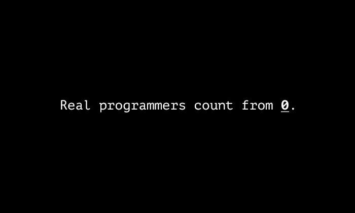
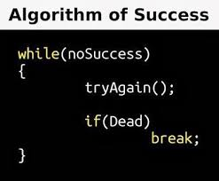

# Dev Joke and Quotes
## Contribution guidelines

* Make sure if you are adding any image add it to images folder then copy path in your commit like:

      

### ALL THE BEST :heart:

***
first rule of programming,
if it works dont touch it
It’s not a bug. It’s an undocumented feature!

***
Talk is cheap. Show me the code.

***

***
"Knock Knock"
"Whos's there?"
very long pause...
"Java"
***
I am not Lazy, I am on Energy Saving Mode.
***

Programmer : Son , can you count to 10??
3 year old son : 1 , 2 , .....
Programmer : Stop , you're not my son.

***
My code DOESN’T work, I have no idea why. My code WORKS, I have no idea why.
***

***
One man’s crappy software is another man’s full time job. – Jessica Gaston
***
Boss: What is your address?
Me: 173.168.15.10

Boss: No, your local address
Me: 127.0.01

Boss: I mean your physical address
Me: 29:01:38:62:31:58

***
while(!(suceed=try()) );
***

***
Q: How many programmers does it take to change a light bulb?

A: none, that's a hardware problem
***
As a programmer, it is your job to put yourself out of business. What you do today can be automated tomorrow. - Doug McIlroy
***
Measuring programming progree by lines of code is like measuring aircraft building progree by weight. - Bill Gates
***
Testing can only prove the presence of bugs, not their absence. – Edsger W. Dijkstra
***

***

***
I'm a beginner and I don't no none, but why do I code?
just for tee from Hacktoberfest
***
“You create a gun module, a gun class, a foot module, and a foot class. After realizing3 you can’t point the gun at the foot, you pass a reference to the gun to a foot object. After the foot is blown up, the gun object remains alive for eternity, ready to shoot all future feet that may happen to appear.” ~  Mark Hammond
***
Ho help, I'm lost is a random forest.
***
Java is to JavaScript what car is to Carpet
***
Q: 0 is False and 1 is True, Right?
A: 1
***
DonaldTrump dt = new DonaldTrump();
dt.setEducation(null);
***
“An SQL query went into a bar. He walked up to two tables and said, “Hi, can I join you?”
***
“There are two ways of constructing a software design. One way is to make it so simple that there are obviously no deficiencies. The other way is to make it so complicated that there are no obvious deficiencies. The first method is far more difficult ~ C.A.R. Hoare 
***
A user Interface is like a joke, if you have to explain it, Its not that Good.
***
### Ahh!! Crap:dizzy_face:

***
"There are 10 kind of people, one who understand this and other who don't!"
***
Q: What's the object-oriented way to become wealthy? 
A: Inheritance
***
